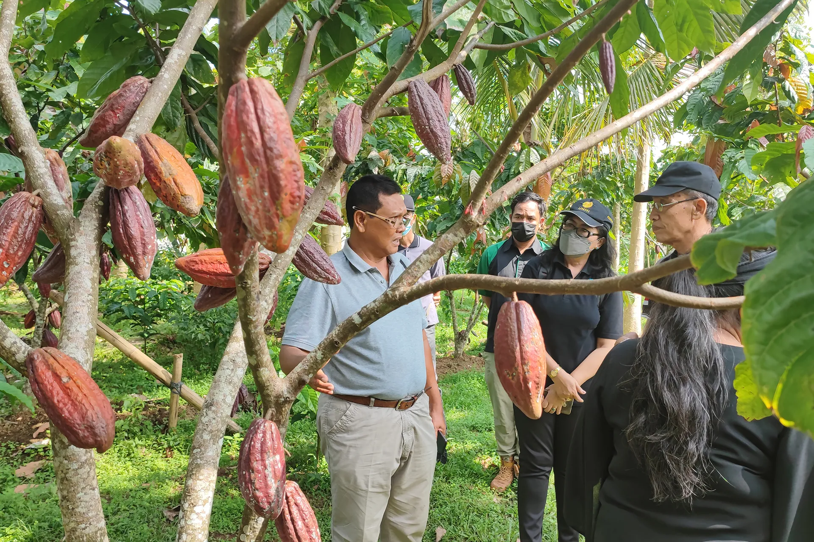

# Itinerary (2)

## 🌿 **Jatiluwih Trip Itinerary**

**📅 7–8 June 2025**

---

### 📍 **Day 1 – Saturday, 7th June**

### 🛫 **07:00 – Depart from Canggu**

Early morning departure in a private car to begin the scenic drive north into Bali’s cooler highlands.

---

### 🍫 **09:00 – Desa Coklat Bali (Chocolate Tour)**

[📍 Google Maps](https://g.co/kgs/arRTLV9)

Experience the journey of Balinese cocoa:

- 🌱 Walk through cocoa plantations
- 🏭 Tour the chocolate-making process
- 🍦 Enjoy natural ice cream tasting

📸 Photo links:

- [Desa Coklat Bali Instagram](https://www.instagram.com/desacoklatbali/?hl=en)
- [Desa Coklat Bali Facebook](https://www.facebook.com/people/Desa-Coklat-Bali/61552827265052/)

---

### 🍽️ **12:00 – Lunch at Famo Cafe Kayu Putih**

[📍 Google Maps](https://g.co/kgs/NoUpVeM)

A serene café offering local dishes amidst rice fields.

📸 Photo links:

- [Famo Cafe Instagram](https://www.instagram.com/famocafe/?hl=en)
- [Famo Cafe Facebook](https://m.facebook.com/100089861820326/)

---

### 🛍️ **13:30 – Traditional Market in Bedugul**

[📍 Google Maps](https://g.co/kgs/wvFHkMB)

Explore local produce, spices, and crafts at this vibrant market.

📸 Photo links:

- [Bedugul Market Instagram](https://www.instagram.com/explore/locations/305483939/bedugul-traditional-market/)
- Bedugul Market Photos

---

### 🚐 **15:00 – Visit Bali Farm House**

[📍 Google Maps](https://g.co/kgs/6LNePcp)

A family-friendly destination with farm animals and photo spots. On the way here, we optionally have strawberry garden, lake, and temple to see. We can also do a little boat tour in the lake.

---

### ♨️ **16:00 – Angseri Hot Spring**

[📍 Google Maps](https://g.co/kgs/LvXHJB5)

Relax in natural hot springs surrounded by lush greenery.

---

### 🏨 **18:00 – Check-in at Ti Amo Bali Resort**

[🌐 Website](https://tiamobaliresort.com/)

A tranquil resort nestled among rice fields, offering traditional Joglo-style villas.

---

### 📍 **Day 2 – Sunday, 8th June**

### 🍳 **08:00 – Breakfast at the Hotel**

Enjoy a traditional breakfast with mountain air and scenic surroundings.

---

### 👨‍🍳 **09:00 – Kubu Terrace Cooking Class & Trekking**

[📍 Google Maps](https://www.tiket.com/to-do/tiket-kubu-terrace-jatiluwih-cooking-class)

Participate in a cooking class and short trek through rice terraces.

---

### 💦 **12:00 – Air Terjun Yeh Hoo (Yeh Hoo Waterfall)**

[📍 Google Maps](https://g.co/kgs/NckPFn5)

A serene waterfall surrounded by rice paddies.

---

### ☕ **14:00 – Coffee Stop: CataVaca Jatiluwih**

[CataVaca Jatiluwih](https://g.co/kgs/BnjnC1h): Café with rice terrace views

---

### 🚙 **15:30 – Depart for Canggu**

Begin the scenic descent back south with estimated arrival around **17:30–18:00**.