# OPTION 1: Amed & Tirta Gangga (East Bali)

## Rundown

**Travel Time:** ~3.5–4 hours from Canggu

| **Day 1** | **Day 2** |
| --- | --- |
| 07:00 – Depart from Canggu | 05:30 – Sunrise trek to ***Bukit Cinta*** (light hike) |
| 10:30 – Visit ***Tirta Gangga Water Palace*** | 08:00 – Breakfast at villa |
| 12:00 – Lunch at **Asri Dining** | 09:30 – Optional visit to ***Lempuyang Temple*** |
| 13:30 – Arrive & check in to villa | 12:00 – Lunch at **Global Village Kafe** |
| 15:00 – Beginner snorkeling at ***Lipah Beach*** | 13:00 – Depart for Canggu |
| 17:00 – Free time to rest or explore the village |  |
| 19:00 – Dinner at villa |  |
| 20:30 – Optional bonfire or beach hangout |  |

---

## Spot Highlights

- **Tirta Gangga Water Palace** - *stunning royal garden filled with ponds, lotus flowers, and stepping stones where you can walk over the water.*
    - Walk through royal gardens, koi ponds, and iconic stepping stones.
    - Learn about the palace’s history from local guides.
    - Take photos surrounded by lotus ponds and Balinese carvings.

Maps: [https://maps.app.goo.gl/aj2uQrgM2V7xkXdx6?g_st=ipc](https://maps.app.goo.gl/aj2uQrgM2V7xkXdx6?g_st=ipc)

.webp)

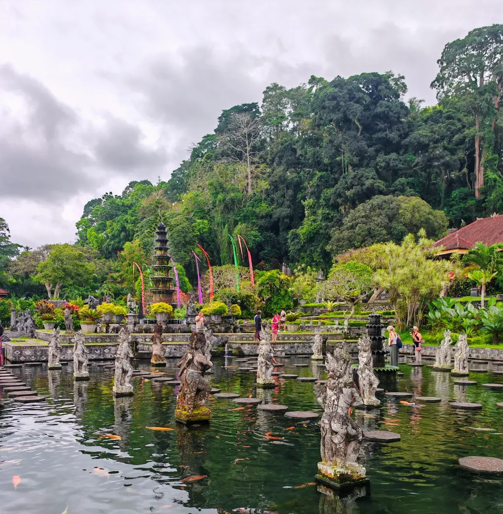

- **Asri Dining Restaurant** *– enjoy traditional Balinese dishes with a view of Mt. Agung.*
    - Try authentic Balinese set lunch cooked on wood-fired stoves
    - Short village or rice terrace walk nearby
    - Optional mini cooking or herbal drink experience
    - Scenic photo stop with Mount Agung backdrop

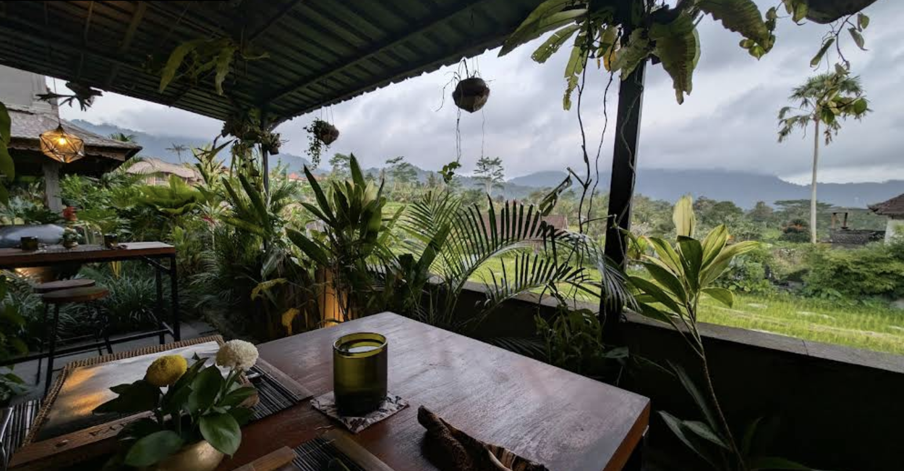

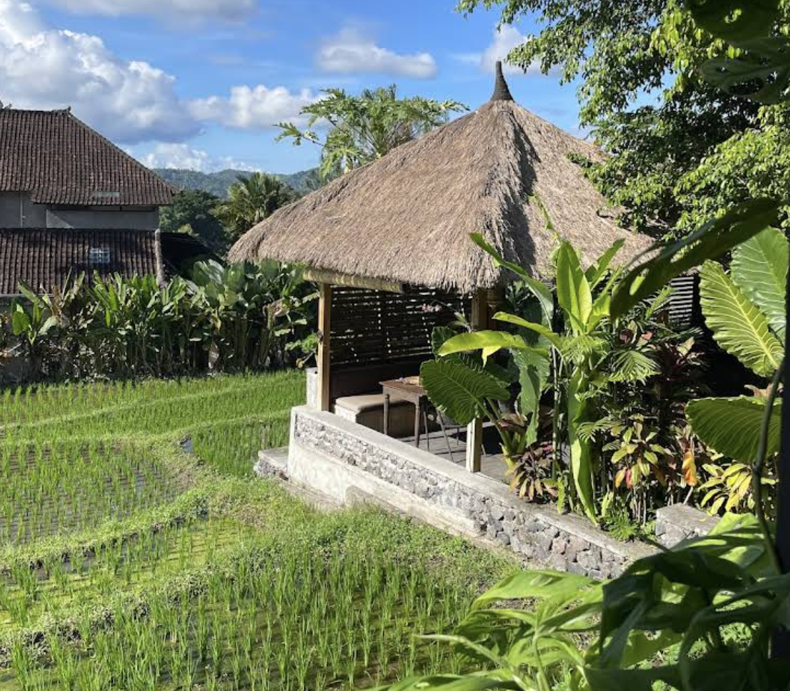

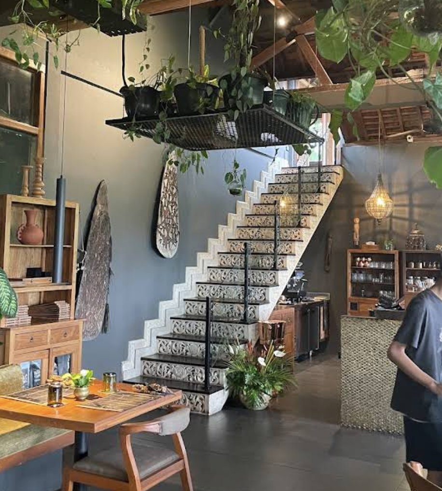

- **Lipah Beach** – *calm black-sand beach, perfect for first-time snorkelers.*
    - Easy entry from shore, calm and clear water.
    - Spot colourful corals, clownfish, and other marine life.
    - Rent snorkelling gear locally (~IDR 50k–75k).

Maps: [https://maps.app.goo.gl/2aXLzxs2s8f3gGAt9?g_st=ipc](https://maps.app.goo.gl/2aXLzxs2s8f3gGAt9?g_st=ipc)

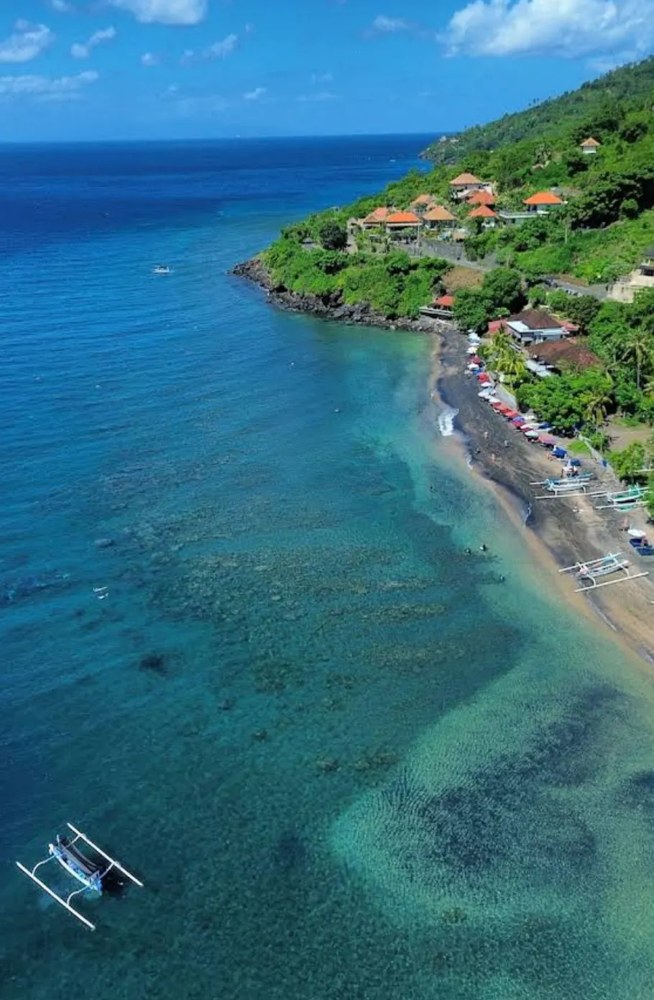

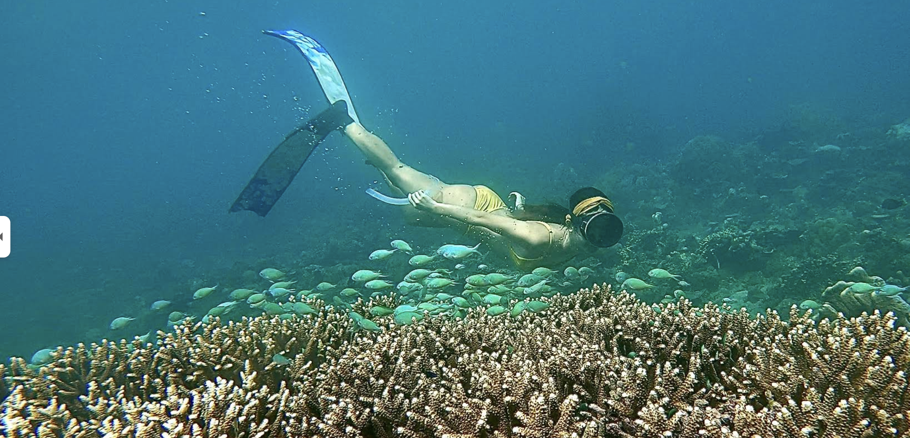

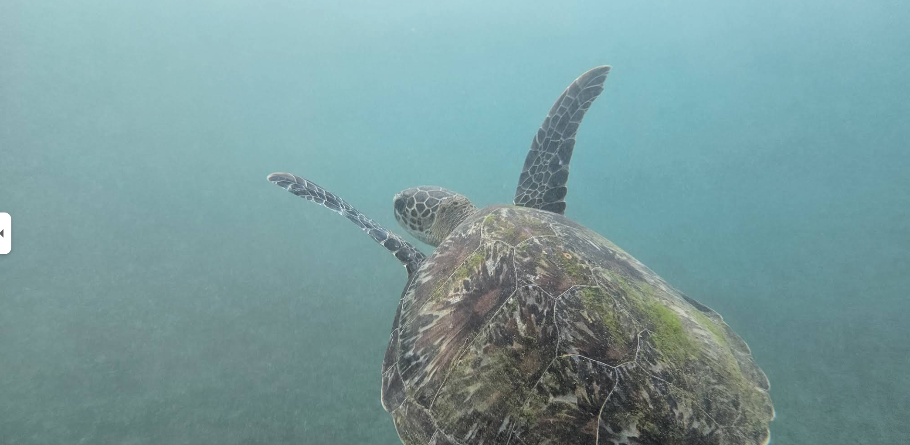

- **Bukit Cinta** *– gentle hill with sunrise views over Mount Agung.*
    - Short 20–30 min walk with stunning view of Mount Agung.
    - Great group photo spot and peaceful morning moment.

Maps: [https://maps.app.goo.gl/9AwwWkbS6XnY152V9](https://maps.app.goo.gl/9AwwWkbS6XnY152V9)

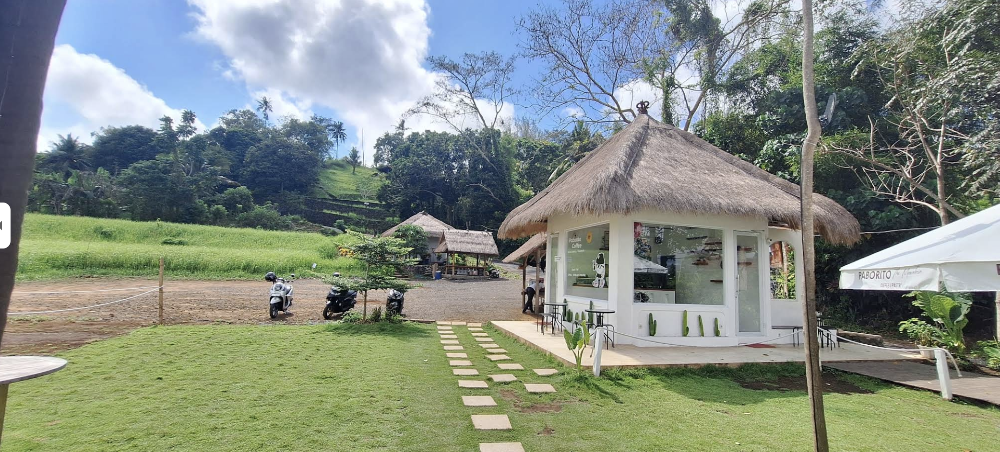

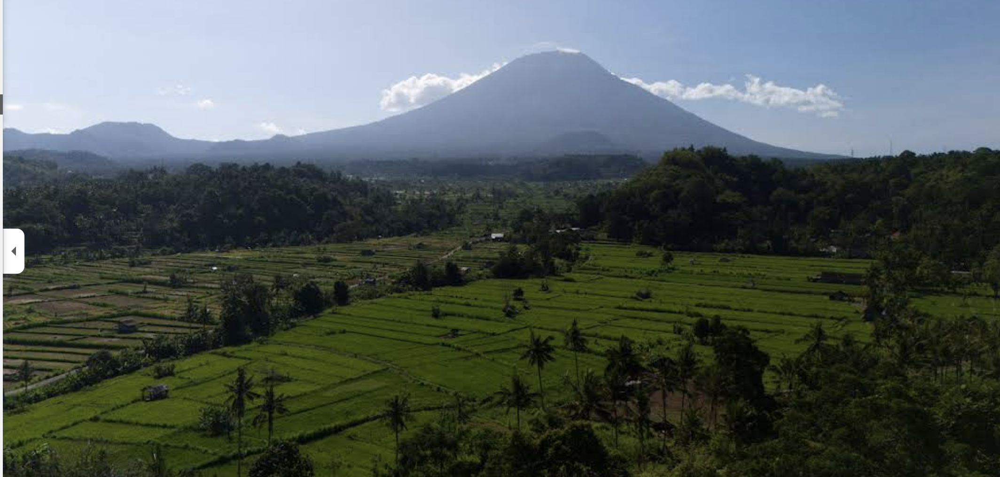

- **Lempuyang Temple** *– iconic “Gates of Heaven,” often surrounded by misty mountains.*
    - Take photos at the famous “Gates of Heaven.”
    - Learn about Balinese Hindu traditions.
    - Optional: hike up to upper temples (1,700+ steps) or stay at the lower gate.

Maps: [https://maps.app.goo.gl/9AwwWkbS6XnY152V9](https://maps.app.goo.gl/9AwwWkbS6XnY152V9)

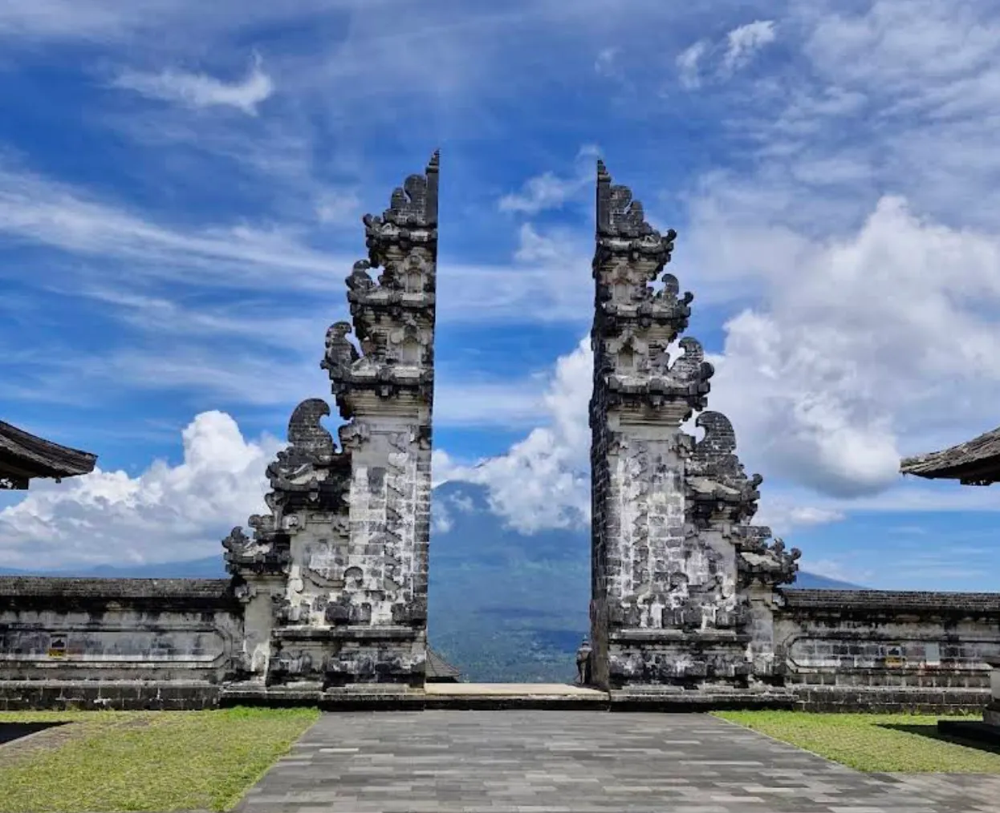

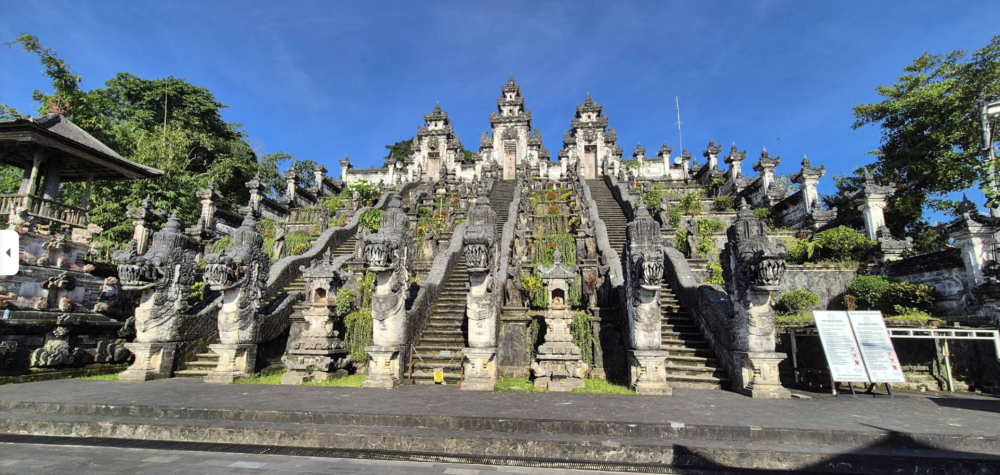

- **Global Village Kafe** *– social enterprise café that supports local education programs; warm atmosphere with **tasty vegetarian** and local dishes.*
    - Lunch at a social-impact café supporting community education.
    - Try Balinese–Western fusion dishes and smoothies before heading back.
    
    Maps: [https://maps.app.goo.gl/me93kA32S7pNLTeb6](https://maps.app.goo.gl/JuBqFgsizuZakNxd9)
    

## Route Trip

[Canggu to Canggu](https://www.google.com/maps/dir/Canggu,+Kuta+Utara,+Badung+Regency,+Bali/Tirta+Gangga/Asri+Dining+by+Samanvaya/Lipah+Beach/Life+in+Amed+Bali+Boutique+Hotel/Bukit+Cinta/Canggu,+Kuta+Utara,+Badung+Regency,+Bali/@-8.5189422,115.3124349,11.08z/data=!4m44!4m43!1m5!1m1!1s0x2dd23861f4589665:0x5030bfbca82fd30!2m2!1d115.1385192!2d-8.6478175!1m5!1m1!1s0x2dd24736f4379ad1:0x65af03b0d108a7d1!2m2!1d115.5872919!2d-8.4123473!1m5!1m1!1s0x2dd211543d8efabb:0x9d0786aaca03426a!2m2!1d115.4407987!2d-8.4747729!1m5!1m1!1s0x2dcdffce2d5ae715:0x935e11d81b5e8ab1!2m2!1d115.6846672!2d-8.3510287!1m5!1m1!1s0x2dd2066784179dfb:0x2c07f246c32a9a19!2m2!1d115.6889366!2d-8.3548917!1m5!1m1!1s0x2dd20653fee6bc91:0x7f956340838dc7a0!2m2!1d115.6088009!2d-8.4262591!1m5!1m1!1s0x2dd23861f4589665:0x5030bfbca82fd30!2m2!1d115.1385192!2d-8.6478175!3e0?entry=ttu&g_ep=EgoyMDI1MTAyMC4wIKXMDSoASAFQAw%3D%3D)

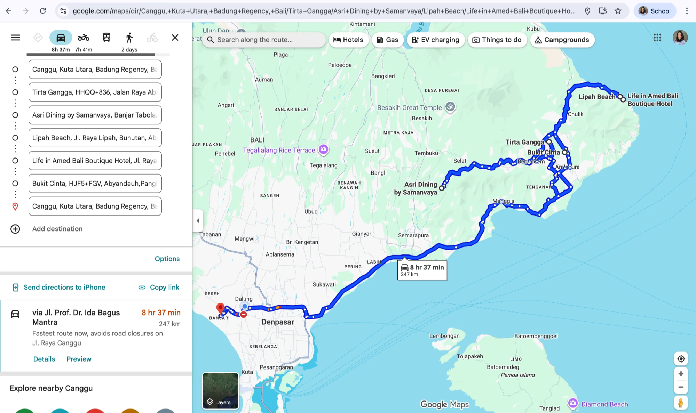

## Villa Reccommendation

| **Villa** | **Approx. Price / Night (IDR)** | **Capacity for 7-10 People** | **Pros ✅** | **Cons ⚠️** |
| --- | --- | --- | --- | --- |
| **Villa Adi Amed**
[https://maps.app.goo.gl/VZJj79uSMHtGzw6f9](https://maps.app.goo.gl/VZJj79uSMHtGzw6f9) | ~ Rp 5 – 8 million per night | Fits ~7-10 by booking 2 units (~6 each) | • More affordable for this group size • Authentic East-Bali vibe | • You still need to book multiple units 
• Simpler amenities |
| **The Griya Villas & Spa**
[https://maps.app.goo.gl/p9ApAbrKf7452PAV8](https://maps.app.goo.gl/p9ApAbrKf7452PAV8) | ~ Rp 8 – 10 million for combined units | Can accommodate ~8-12 when combined | • Stylish, good for mid-sized groups • Great views and amenities | • Must combine units • Check exact rooms & configuration |
| **Villa Bukit Segara**
[https://maps.app.goo.gl/sU4LYAM1VzJv6FRm8](https://maps.app.goo.gl/sU4LYAM1VzJv6FRm8) | ~ Rp 12-15 million per night* | Whole villa (fits 16-18) → good margin | • Big full villa, beachfront, premium for groups | • Higher cost, more than you strictly need for 7-10 
• Booking whole villa required |
| **Saka Villa**
[https://maps.app.goo.gl/dSyLUgxMXxQAppg67](https://maps.app.goo.gl/dSyLUgxMXxQAppg67) | ~ Rp 2 – 4 million per 2-bedroom unit | Not sufficient alone; need 2-3 units to reach ~7-10 | • Very affordable per unit 
• Quiet location near Lipah Beach | • Need multiple units 
•Coordination required for group logistics |

## additional notes:

- would probably change to the asri dining lunch to the day 2 and skip the global village kafe, to have proper time for snorkelling at amed (based on snorkeling tour guide recommendation)
- **AMED BEST SNORKELING** ([https://maps.app.goo.gl/o7gGgBZSK2zgSzNk6](https://maps.app.goo.gl/o7gGgBZSK2zgSzNk6))
    
    (3 spots snorkeling : selang beach coral garden,lipah bay turtle point dan jemeluk bay coral garden, 1hour/spot)
    
    
    
- **OCEANDIVE - Snorkeling agent**
    
    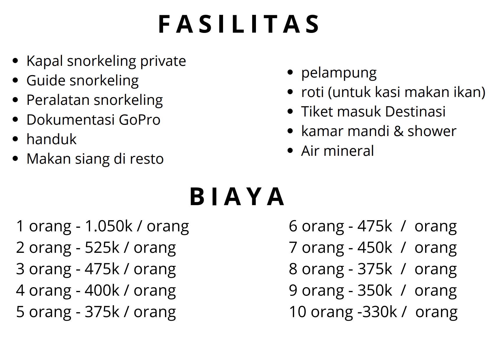