# OPTION 2: Pemuteran & Menjangan Island (West Bali)

## Rundown

**Travel Time:** ~4.5–5 hours from Canggu

| **Day 1** | **Day 2** |
| --- | --- |
| 06:30 – Depart from Canggu | 07:30 – Slow breakfast at villa and check out |
| 10:30 – *Optional:* Stop at **Aling-Aling Waterfall** – swim, short trek, and nature break  | 09:30 – *ptional:* Stop at **Twin Lakes Viewpoint** (Buyan & Tamblingan) 🌄 |
| 12:30 – Lunch in villa  | 10:30 – **Learn & Explore at Munduk Moding Plantation** ☕ |
| 13:30 – Visit **Turtle Hatchery Project** – learn about sea turtle conservation 🐢 | 12:30 – Lunch at **Warung Asri Dining** or plantation restaurant 🍽️ |
| 14:00 – *Snorkeling at **Menjangan Island*** (3–4 hrs) | 14:00 – Depart for Canggu |
| 18:00 – Return, sunset, and relax |  |
| 19:30 – Dinner at villa  |  |

### Spot Highlights

- **Munduk Coffee** *– a scenic coffee estate surrounded by misty hills, where students can enjoy fresh local coffee, stunning views, and join hands-on experiences like coffee tasting, plantation walks, or traditional craft workshops.*
    - Visit **Munduk Coffee Plantation** or **Munduk Moding Plantation**, known for coffee tasting with panoramic valley views.
    - Learn about local Arabica roasting and try fresh plantation-brewed coffee or chocolate.
    - Optional short **waterfall trek** — *Munduk Waterfall* or *Melanting Waterfall* (10–20 mins walk).
    - Experience local workshops:
        - Coffee brewing or farm walk experience
        - Traditional cooking class using local ingredients
        - Guided plantation tour with stories from local farmers
    - Optional photo stop at **Twin Lakes Viewpoint (Buyan & Tamblingan)** nearby.
    
    Web: [https://mundukmodingplantation.com/munduk-coffee/](https://mundukmodingplantation.com/munduk-coffee/)
    
    Maps: [https://maps.app.goo.gl/YLe9vCeHcWcvqX8L7](https://maps.app.goo.gl/YLe9vCeHcWcvqX8L7)
    

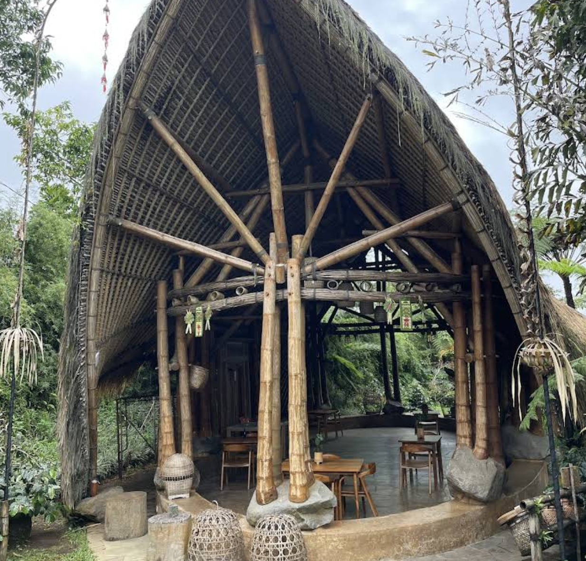

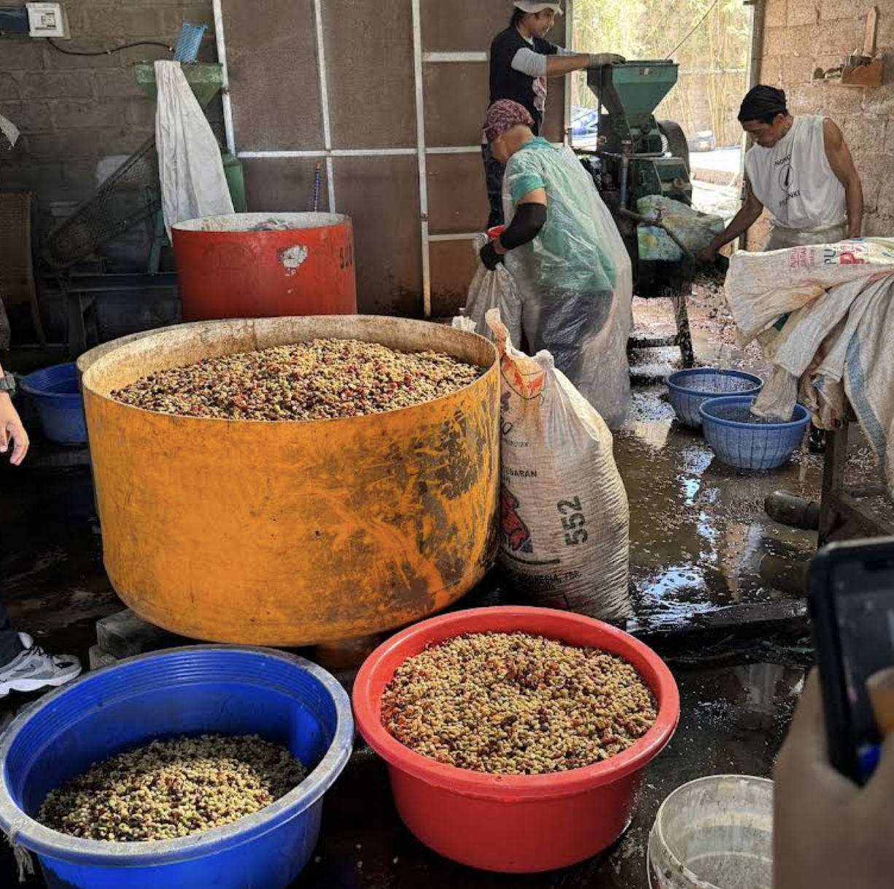

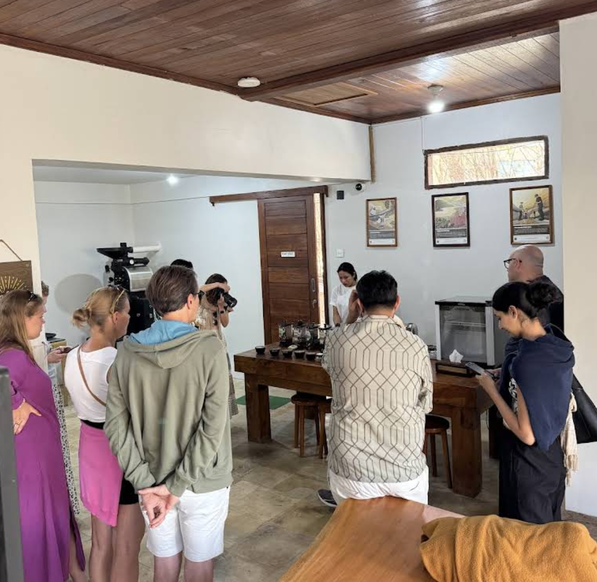

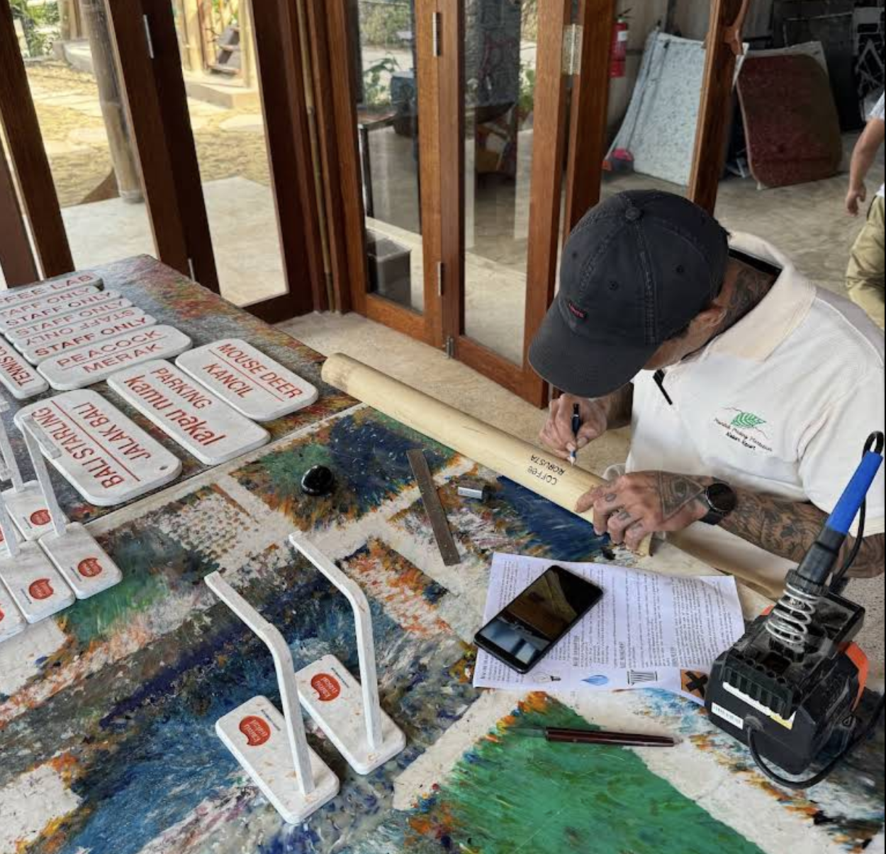

- **Menjangan Island** *– part of West Bali National Park, known for its crystal-clear water and incredible coral reefs — great for snorkeling beginners.*
    - Take a short boat ride to **Menjangan Island**, part of Bali Barat National Park.
    - Beginner-friendly snorkeling with calm, clear water.
    - See coral walls, turtles, clownfish, and underwater temples.
    - Entrance fee: IDR 200k–300k/person (includes park and boat).
    
    Maps: [https://maps.app.goo.gl/c12DKf3TDKL5EusKA](https://maps.app.goo.gl/c12DKf3TDKL5EusKA)
    

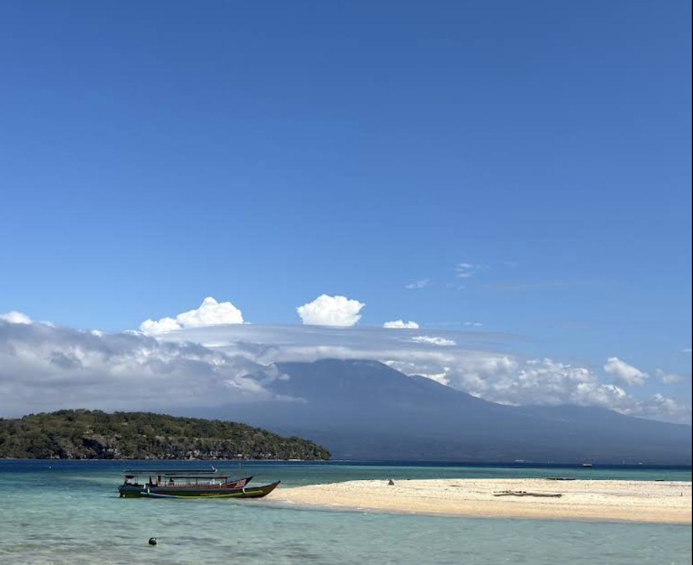

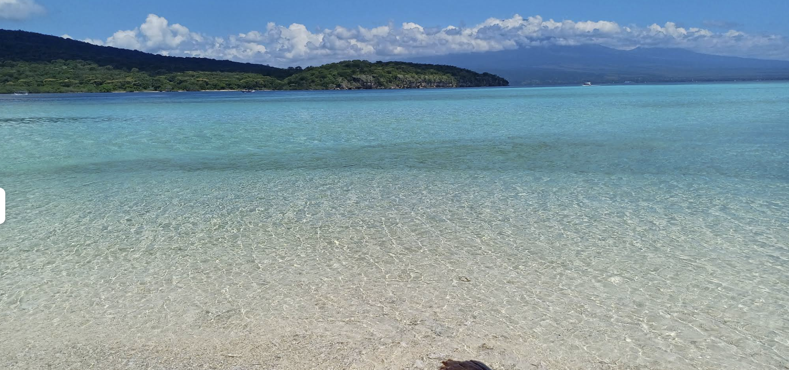

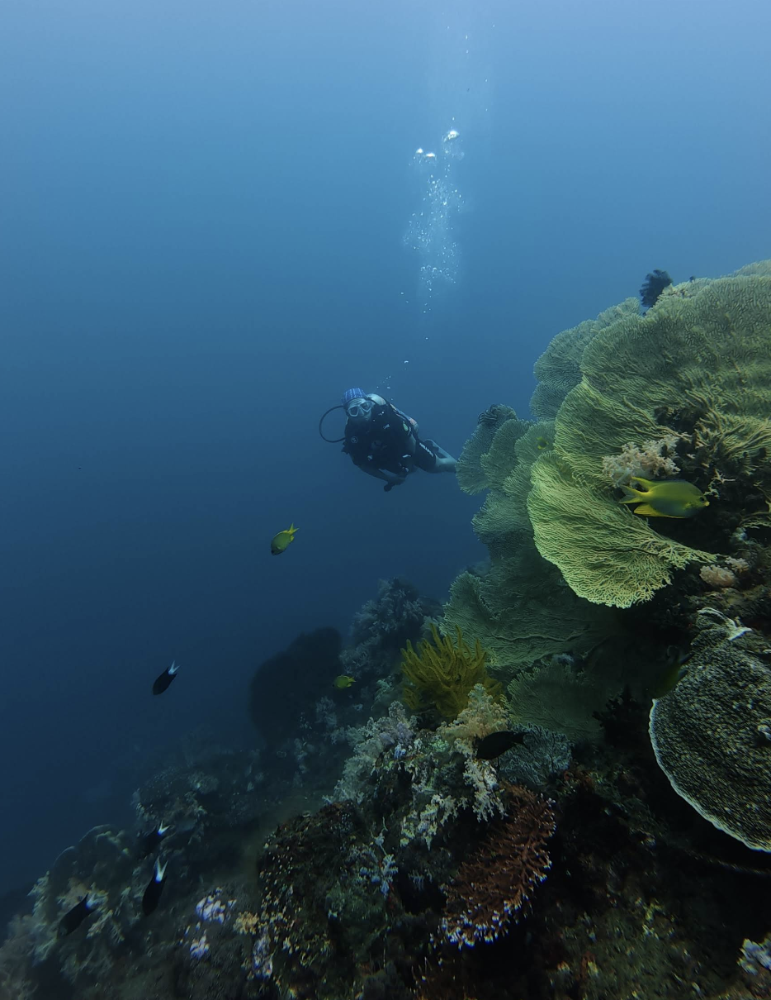

- **Turtle Hatchery Project** *— learn about sea turtle conservation and local marine life.*
    - Learn how local groups protect sea turtles and coral reefs.
    - Optional: help release baby turtles (depending on hatching season).
    - Insightful, hands-on environmental learning experience.
    
    Maps: [https://maps.app.goo.gl/me93kA32S7pNLTeb6](https://maps.app.goo.gl/me93kA32S7pNLTeb6)
    

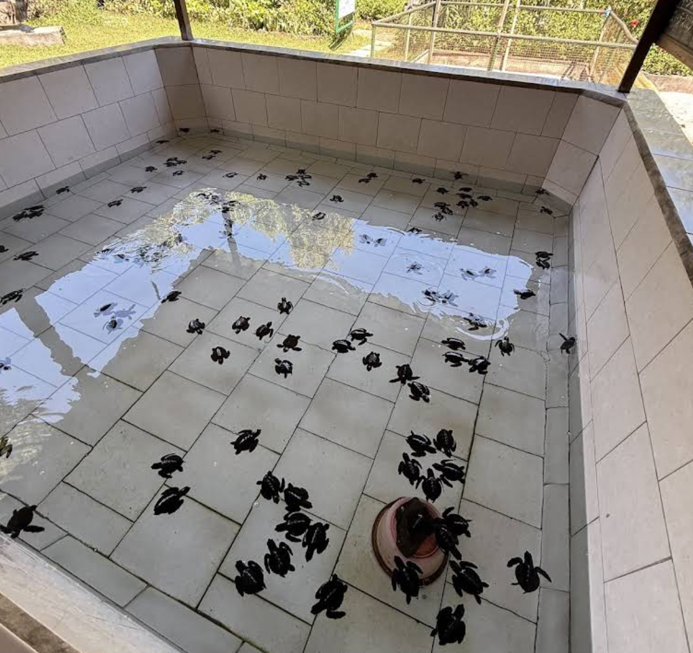

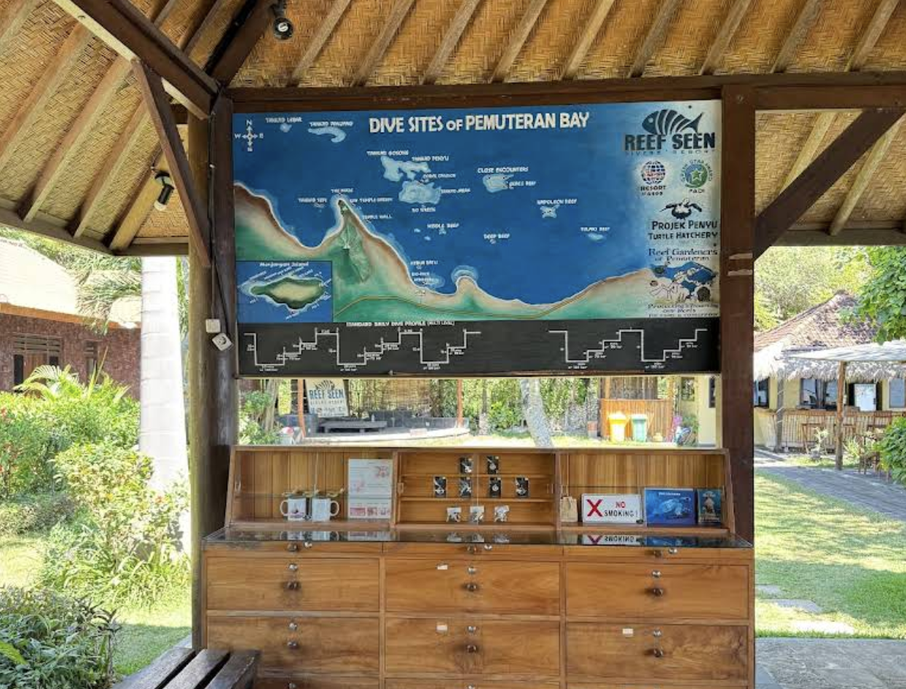

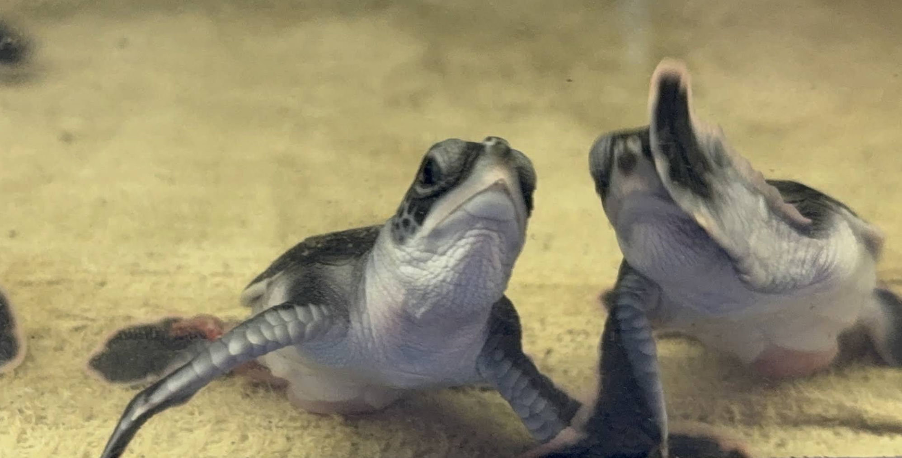

- **Global Village Kafe** *– social enterprise café that supports local education programs; warm atmosphere with **tasty vegetarian** and local dishes.*
    - Lunch at a social-impact café supporting community education.
    - Try Balinese–Western fusion dishes and smoothies before heading back.
    
    Maps: [https://maps.app.goo.gl/me93kA32S7pNLTeb6](https://maps.app.goo.gl/JuBqFgsizuZakNxd9)
    

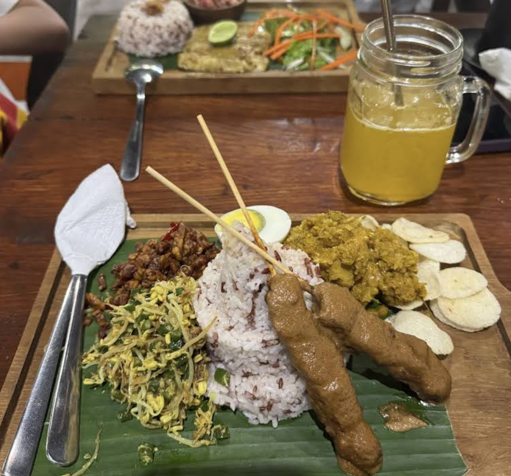

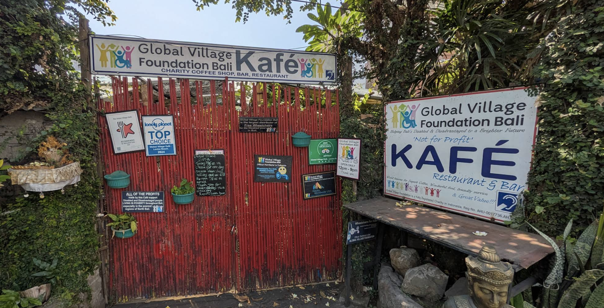

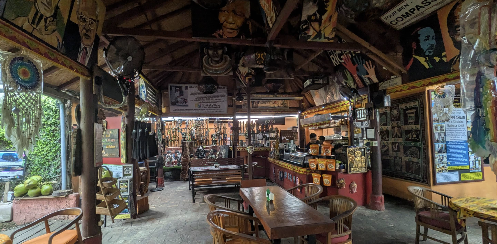

---

## Route

[Canggu to Canggu](https://www.google.com/maps/dir/Canggu,+Kuta+Utara,+Badung+Regency,+Bali/Munduk+Moding+Plantation+Nature+Resort,+Jl.+Asah+Gobleg,+Gobleg,+Banjar,+Buleleng+Regency,+Bali+81152/Pemuteran+Beach,+Pemuteran,+Gerokgak,+Buleleng+Regency,+Bali+81155/The+Menjangan+by+LifestyleRetreats,+VH42%2BV6Q,+West+Bali+National+Park,+Jl.+Singaraja-Gilimanuk+No.Km.+17,+Pejarakan,+Gerokgak,+Buleleng+Regency,+Bali+81155/Labuan+Lalang+menuju+Nusabay+Menjangan,+VG4Q%2BVJX,+Jl.+Labuhan+Lalang,+Sumber+Klampok,+Kec.+Gerokgak,+Kabupaten+Buleleng,+Bali+81155/Turtle+Hatchery+Project,+VM44%2BC8C,+Pemuteran,+Gerokgak,+Buleleng+Regency,+Bali+81155/The+Global+Village+Foundation+Kafe,+Jl.+Raya+Lovina-Singaraja,+Anturan,+Buleleng,+Buleleng+Regency,+Bali+81191/Canggu,+Kuta+Utara,+Badung+Regency,+Bali/@-8.2324041,114.756271,9z/data=!4m49!4m48!1m5!1m1!1s0x2dd23861f4589665:0x5030bfbca82fd30!2m2!1d115.1385192!2d-8.6478175!1m5!1m1!1s0x2dd185ea534e3363:0xbe389e2c75f5183!2m2!1d115.073687!2d-8.2391504!1m5!1m1!1s0x2dd16e8be5074bdd:0x1eda4478a0d31e32!2m2!1d114.6574647!2d-8.1440918!1m5!1m1!1s0x2dd169eca57af51f:0xdab63fb058bc950b!2m2!1d114.5469677!2d-8.1438451!1m5!1m1!1s0x2dd169eee339983d:0x1c8994cd11d38bbd!2m2!1d114.5390968!2d-8.1427712!1m5!1m1!1s0x2dd16ef293b130ff:0xa9057f96915f09f5!2m2!1d114.6557551!2d-8.1439385!1m5!1m1!1s0x2dd19b3eefc4fafd:0x7c83e6eb782a8df1!2m2!1d115.0267307!2d-8.1618295!1m5!1m1!1s0x2dd23861f4589665:0x5030bfbca82fd30!2m2!1d115.1385192!2d-8.6478175?entry=ttu&g_ep=EgoyMDI1MTAyMC4wIKXMDSoASAFQAw%3D%3D)

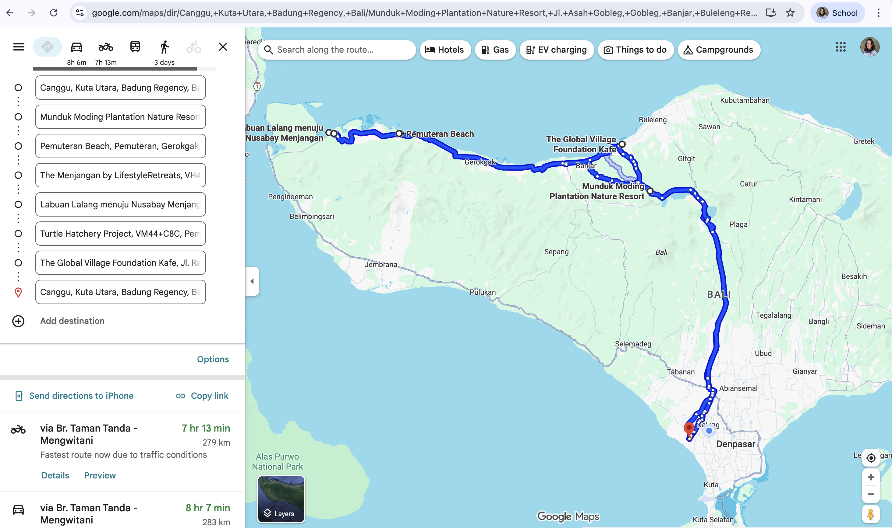

## Villa Recommendation

| **Property** | **Estimate price / night (IDR)** | **Capacity**  | **Pros ✅** | **Cons ⚠️** |
| --- | --- | --- | --- | --- |
| **Amertha Bali Villas (Pemuteran)**

[https://maps.app.goo.gl/jdx9xtV8XdgyfLS29](https://maps.app.goo.gl/jdx9xtV8XdgyfLS29) | **Rp 2,000,000 – Rp 5,000,000** (typical: book **2–3 villa suites** / night to fit ~7) | Suites with private terraces / pools — book **2 large suites + rollaway** (or 3 standard) to sleep ~7 comfortably | • True beachfront resort feel and private-pool suites  
• Onsite dive/snorkel desk + easy access to BioRock & turtle project  
• Good for mixed comfort & value | • To host 7 people you’ll likely book multiple suites (coordination)  
• Some mandatory deposits / hotel fees apply |
| **Taman Sari Bali Resort & Spa (Pemuteran)**

[https://maps.app.goo.gl/sAZoBmyw5VmkxCWH6](https://maps.app.goo.gl/sAZoBmyw5VmkxCWH6) | **Rp 4,000,000 – Rp 8,000,000** (one or two connected villa suites / or private villa units) | Each villa/suite can be combined — book **1 large villa + 1 suite** (or 2 suites) to fit ~7 | • Private pools available per villa unit  
• Strong eco / coral restoration program (Biorock) — great learning for students  
• Resort services (meals, spa) simplify group logistics | • Slightly pricier if you want private-pool villas only  
• Remote , fewer outside cafés but calm setting |
| **The Bali Menjangan Boutique Villas & Dive Center**

[https://maps.app.goo.gl/BRk63wczXRjNYGPRA](https://maps.app.goo.gl/BRk63wczXRjNYGPRA) | **Rp 2,500,000 – Rp 6,000,000** (book 2–3 family rooms or one larger villa / suite set) | Family rooms + pool villas — reserve **2 family rooms + extra bed** or a villa to fit ~7 | • Built for dive/small-group guests — very close to Menjangan snorkel boats  
• Resort amenities (pool, restaurant, yoga) and good guest reviews  
• Flexible room types for groups | • Not all units are full private villas (you may be in separate rooms)  • Location is quiet — fewer nightlife options |

## Notes;

- Munduk Moding Plantation Entrace Fee: 300k/person weekend
- Turtle Hatchery Project entrace Fee: 40k/person
- Menjangan Snorkeling
    
    [https://www.instagram.com/snorkelingmenjanganislandbali?igsh=MTVvM3l1bWx0dWxyZA==](https://www.instagram.com/snorkelingmenjanganislandbali?igsh=MTVvM3l1bWx0dWxyZA==)
    
    400k/person  2 spot, 4hours, include break and meal
    
    Include:
    -Boats private
    -Guide
    -Intrarance Fees tiket
    -Insurance
    -Equipment ful set
    -Lunch
    -Mineral water-softdrink
    -Towels
    -pick-up drop hotel menjangan area
    -documentation